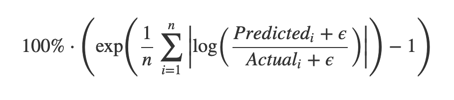

# VK CUP

### Описание задачи -- Vk Ads Auction Forecasting Challenge

Реклама ВКонтакте работает по тем же принципам, что и большинство рекламных систем – на основе аукциона (тут можно ссылку на мой доклад из VK Tech). Чем больше рекламодатель готов заплатить за показ рекламы пользователю – тем больше людей увидят его рекламу.   

Ваша задача – предсказать, какое количество людей увидят конкретное рекламное объявление в будущем.

Вам даны:
- датасет пользователей `users.tsv`
- датасет показов рекламы пользователям за два последовательных месяца `history.tsv`
- датасет объявлений для валидации алгоритма – `validate.tsv`
- датасет эталонных ответов алгоритма для валидационного датасета – `validate_answers.tsv`

все файлы в формате `tsv` (разделитель колонок – `\t`) с обязательным заголовком для всех колонок. 

#### Описание файлов и колонок:

`users.tsv`:
- `user_id` – уникальный идентификатор пользователя
- `sex` – указанный пользователем пол в анкете
- `age` – указанный пользователем в анкете возраст пользователя. 0 – не указан.
- `city_id` - указанный пользователем в анкете город проживания. 0 – не указан.

`history.tsv`:
- `hour` – в какой час пользователь видел объявление
- `cpm` - цена показанного рекламного объявления в рекламном аукционе. Это значит, что на данном аукционе это была максимальная ставка. 
- `publisher` - площадка, на который пользователь видел рекламу
- `user_id` - уникальный идентификатор пользователя

`validate.tsv`:
- `cpm` - для какой цены объявления нужно сделать прогноз
- `hour_start` - предположительное время запуска рекламного объявления
- `hour_end` - предположительное время остановки рекламного объявления. По итогу прогноз делается для рекламного объявление, которое будет запущено в период времени `[hour_start, hour_end]`
- `publishers` - на каких площадках объявление может быть показано
- `audience_size` - размер аудитории объявления, количество идентификаторов в поле `user_ids`
- `user_ids` – аудитория объявления – список пользователей, кому рекламодатель хочет показать объявление.

`validate_answers.tsv`:
- `at_least_one` - доля пользователей, которая увидит объявление хотя бы один раз
- `at_least_two` - доля пользователей, которая увидит объявление хотя бы два раза
- `at_least_three` - доля пользователей, которая увидит объявление хотя бы три раза

Ваш алгоритм будет тестироваться на следующем месяце, после доступной вам истории показов. То есть, hour_start и hour_end в тестовых заданиях не будут пересекаться с hour из доступной вам `history.tsv`.

Пользователи в тестовых заданиях будут выбраны из `users.tsv`, который вам доступен.

Задания выглядят идентично заданиям из `validate.tsv`, вывод ожидается ровно в таком же формате, что и `validate_answers.tsv`.

#### Метрика оценки задачи

Задача оценивается по метрике, которая считается значениям из всех трех колонок –`at_least_one`, `at_least_two` и `at_least_three`.

Метрика – Smoothed Mean Log Accuracy Ratio, переведенная в проценты.

$$ 100\% \cdot \left( \exp \left( \frac{1}{n} \sum_{i=1}^{n}\left|\log\left(\frac{ Predicted_i + \epsilon}{Actual_i + \epsilon}\right)\right| \right) - 1 \right) $$

$\epsilon = 0.005$

EPS = 0.005

Метрика интерпретируется следующим образом: это среднее значение относительного расхождения эталона и предсказанного значения в процентах. 

Например, значение 30% значит, что в среднем модель ошибается на 30% от реальности. Чем ближе метрика к 0 – тем лучше.

Сглаживание в метрике нужно, чтобы уменьшить влияние относительной ошибки там, где эталон близок к нулю. 

Логарифм в метрике берется для того, чтобы overpredict и underpredict расчитывались симметрично.

####  Важные условия работы аукциона и условности задачи:
- Если ставка объявления `cpm` больше всех ставок всех остальных участников: со 100% вероятность выигрывает объявление со ставкой `cpm`
- Если ставка объявления `cpm` равна максимальной ставке среди всех остальных участников: объявление со ставкой `cpm` выигрывает с вероятностью в 50%. В реальном аукционе объявление может выигрывать по совершенно другим правилам и вероятностям, это упрощение для моделирования конкретно в данном датасете. 
- Система запоминает все объявления, который видел пользователь в течении сессии и не показывает их, даже если это самые дорогие объявления в аукционе.  Новая сессия начинается после отсутсвия показов рекламы пользователю в течении 6 часов.
